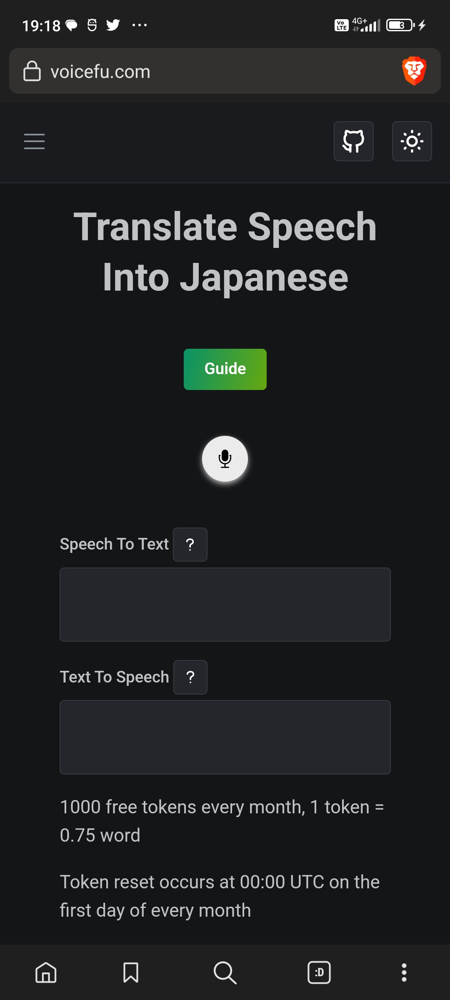

# Update
Project is not working now, I turned off the server.
# Voice Synthesis

https://user-images.githubusercontent.com/5227509/235647791-63df3845-fd5e-4f77-a106-149d26622e90.mp4

This web application translates speech into Japanese speech, try it at [voicefu.com](https://voicefu.com/)

Techs:

1. Speech to text: [Whisper](https://platform.openai.com/docs/guides/speech-to-text)
2. Translation: [GPT](https://platform.openai.com/docs/guides/chat)
3. Japanese Voice Synthesis: [Voicevox](https://github.com/VOICEVOX/voicevox_engine)

[back end code](https://github.com/tylim88/Voicefu-back-end)

This project is inspired by this [youtube video](https://www.youtube.com/watch?v=UY7sRB60wZ4)

Responsive design, works on phone

## Development Mode

1. Install dependencies with `npm run setup`
2. This project use Firebase Firestore, please enable Firestore in Firebase Console
3. This project use Firebase Authentication, please enable Google sign in method in Firebase Console
4. Replace `src/firebase_/config.ts` with your own Firebase config. (Note: This is not a secret but should move to `.env` file to make environment switching easier)
5. Create a `.env` file at project root and paste `VITE_BASE_URL=http://localhost:3001` into it.
6. `npm run dev` to view the website on `http://127.0.0.1:5173/`
7. For Chrome users, Chrome will block localhost with CORS, please install this [Chrome extension](https://chrome.google.com/webstore/detail/allow-cors-access-control/lhobafahddgcelffkeicbaginigeejlf) to allow CORS. Please note that, when the add-on is added to your browser, it is inactive by default (toolbar icon is grey C letter). If you want to activate the add-on, please open the toolbar popup and press the toggle button on the left side. The icon will turn to an orange C letter.

## Production Mode

The repo is ready for production, but you will probably go with your tech stack anyway.

Open an issue if you really need one, and I will complete this read me.
